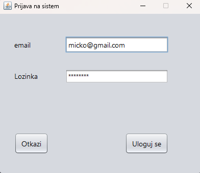
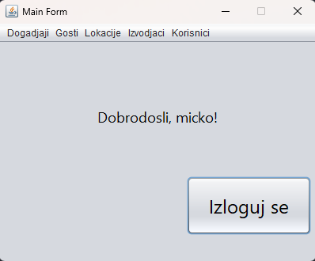
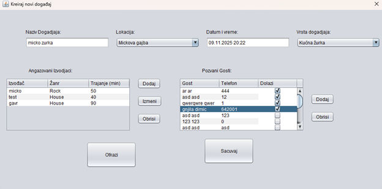
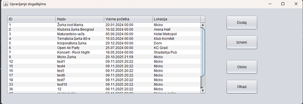
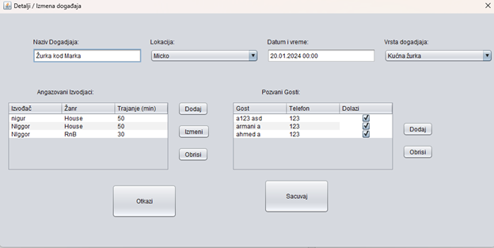

<<<<<<< HEAD
# Event Management System in Java

A desktop-based event planning and management system built in Java, following a three-tier architecture and the simplified Larman methodology.
The application allows organizers to create events, manage guests, performers, locations, and attendance confirmations through a structured client–server model.

## Features

### Event Management
- Create events
- Edit events
- Delete events
- Assign performers with performance durations
- Add guests to events
- Track RSVP confirmations
- Choose event location, date, type, and time

### Guest Management
- Add guests
- Edit guests
- Delete guests
- Search guests by criteria (e.g., last name)

### Performer Management
- Create performers
- Update performer information
- Delete performers

### Location Management
- Add new locations
- Update locations
- Delete locations
- Validate location capacity

### Authentication
- Login with username and password
- System user role (organizer)
- Validation and feedback messages

### System Architecture
- Client UI implemented using Java Swing
- Server-side logic using Java socket communication
- Custom database broker layer
- REST-like request/response communication
- Full CRUD support for all domain objects

## Screenshots

<!-- Ovde dodaj svoje slike, npr: -->
<!--  -->

## Three-Layer Architecture

### UI Layer
Swing forms for:
- Login
- Creating events
- Managing guests
- Managing performers
- Administration views

### Application Logic Layer
System operations such as:
- `SOPrijaviKorisnika`
- `SOKreirajDogadjaj`
- `SOIzmeniDogadjaj`
- `SOObrisiDogadjaj`

### Data Layer
- Database broker responsible for executing SQL operations

## Core Domain Model

The system uses the following entities:
- `User`
- `Event`
- `Guest`
- `Performer`
- `Location`
- `Engagement` (Event–Performer link)
- `Confirmation` (Guest–Event attendance)

## System Operations (Highlights)

- `SOPrijaviKorisnika(Korisnik)`
- `SOKreirajDogadjaj(Dogadjaj)`
- `SOIzmeniDogadjaj(Dogadjaj)`
- `SOObrisiDogadjaj(Dogadjaj)`
- `SOKreirajGosta(Gost)`
- `SOPronadjiGosta(Gost)`
- `SOKreirajIzvodjaca(Izvodjac)`
- `SOKreirajLokaciju(Lokacija)`

## Database Model

### Relational Tables
- **Lokacija** (`LokacijaId`, `Naziv`, `Adresa`, `Kapacitet`)
- **Gost** (`GostId`, `Ime`, `Prezime`, `Telefon`)
- **Izvodjac** (`IzvodjacId`, `Ime`, `Zanr`)
- **Dogadjaj** (`DogadjajId`, `Naziv`, `DatumVreme`, `Vrsta`, `LokacijaId`, `KorisnikId`)
- **Angazman** (`DogadjajId`, `IzvodjacId`, `Trajanje`)
- **Potvrda** (`GostId`, `DogadjajId`, `Status`, `DatumVreme`)
- **Korisnik** (`KorisnikId`, `Ime`, `Prezime`, `Email`, `Lozinka`)

## Testing

Testing includes:
- Manual UI testing
- Scenario-based testing following sequence diagrams
- Positive and negative system operation tests
- Login functionality testing
- CRUD operation testing
- Data consistency validation

## Documentation

Full project documentation is provided in:
- `2020-0492-Dimitrije_Mitic Dokumentacija.docx`

## Author

**Dimitrije Mitić**
- Faculty of Organizational Sciences (FON)
- Information Systems & Technologies
=======
#Event Management System in Java

A desktop-based event planning and management system built in Java, following a three-tier architecture and the principles of the simplified Larman methodology.
The application allows organizers to create events, manage guests, performers, locations, and attendance confirmations through a structured client-server model.

Features
Event Management

Create, update and delete events

Assign performers with performance durations

Add guests to events

Track RSVP confirmations

Select event location, date, time, and type

Guest Management

Add new guests

Edit existing guests

Delete guests

Search guests by criteria (e.g. last name)

Performer Management

Create performers

Update performer info

Delete a performer

Location Management

Add new locations

Update existing ones

Remove locations

Capacity validation

Authentication

Login with username and password

System user role (organizer)

Validation and feedback messages

System Architecture

Client-side UI (Swing)

Server-side logic (Java socket server)

Database logic (custom broker layer)

REST-like request/response model over sockets

Full CRUD support for all domain objects

Screenshots

Three-Layer Architecture
UI Layer

Swing forms (login, event creation, guest management, admin views)

Application Logic

Controller and system operations such as:

SOPrijaviKorisnika

SOKreirajDogadjaj

SOIzmeniDogadjaj

SOObrisiDogadjaj

Data Layer

Database broker handling SQL operations

Core Domain Model

The system is built around the following entities:

User

Event

Guest

Performer

Location

Engagement (Event–Performer link)

Confirmation (guest attendance)

System Operations (Highlights)

SOPrijaviKorisnika(Korisnik)

SOKreirajDogadjaj(Dogadjaj)

SOIzmeniDogadjaj(Dogadjaj)

SOObrisiDogadjaj(Dogadjaj)

SOKreirajGosta(Gost)

SOPronadjiGosta(Gost)

SOKreirajIzvodjaca(Izvodjac)

SOKreirajLokaciju(Lokacija)

Database Model

Relational tables:

Lokacija (LokacijaId, Naziv, Adresa, Kapacitet)

Gost (GostId, Ime, Prezime, Telefon)

Izvodjac (IzvodjacId, Ime, Zanr)

Dogadjaj (DogadjajId, Naziv, DatumVreme, Vrsta, LokacijaId, KorisnikId)

Angazman (DogadjajId, IzvodjacId, Trajanje)

Potvrda (GostId, DogadjajId, Status, DatumVreme)

Korisnik (KorisnikId, Ime, Prezime, Email, Lozinka)

Testing

The system was tested using:

Manual UI testing

Sequence-diagram-based scenario validation

Positive and negative system operation responses

Login tests

CRUD tests

Data consistency checks

Documentation

Full system documentation is included in:

2020-0492-Dimitrije_Mitic Dokumentacija.docx

Author

Dimitrije Mitić
Faculty of Organizational Sciences (FON)
Information Systems & Technologies
>>>>>>> fbe117f (Old project deleted)
